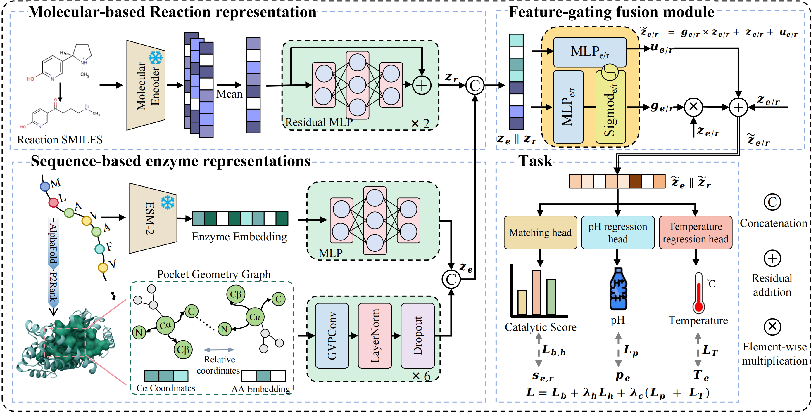

GERO / ERCP
===========

Core training, preprocessing, and evaluation code for the GERO/ERCP retrieval model.
This upload is structured for readers who want to reproduce the paper results.

Model Figure 🧬
--------------



What Is Included ✅
------------------
- Training and evaluation code: train_fix_rxn.py, evaluate_retrieval_fix.py, evaluate_enzyme_pair_mae_rmse.py.
- Retrieval utilities: ERCP_retrieval.py, ERCP_One_retrieval.py.
- Preprocessing scripts: data_pre.ipynb, build_gvp_from_cif.py, scripts/*.
- Baselines: baseline/*.
- Core model and dataset implementation: src/*.

Data & Checkpoints 📦
--------------------
Public download (Google Drive):
https://drive.google.com/drive/folders/1zKBrquXCPakme-bJkR6aZeY_n6bGsPD4?usp=drive_link

Included files:
- enzyme_reaction_data_splits.csv
- best_model_ercp_enzyme_smi.pth
- best_model_ercp_reaction_smi.pth

Suggested placement:
- If you keep default script paths (no edits), place the CSV at:
  ./dataset/enzyme_reaction_data_splits.csv
- Training saves checkpoints to ./checkpoints by default (relative to your run directory).
  For evaluation, pass --checkpoint explicitly, or place the .pth files under ./checkpoints
  and reference them from there.

Default paths observed in scripts (no flag changes):
- train_fix_rxn.py / ERCP_retrieval.py / evaluate_retrieval_fix.py:
  --data_path ./dataset/
  --data_csv ./dataset/enzyme_reaction_data_splits.csv
  --gvp_dir ./dataset/pocket_dataset/processed_tensors/
  --esm_emb ./dataset/esm_sequence_embeddings.pt
- scripts/build_rxn_unimol.py, scripts/build_rxn_ChemBERTa.py, bulid_rxn_rxnfp.py:
  data_path = ./dataset/

Note: embedding files are not in the drive; generate them with the preprocessing steps below.

Environment 🧰
-------------
Python 3.9+ is recommended.

Install Python dependencies:

```bash
pip install -r requirements.txt
```

Additional external tools used by some steps:
- P2Rank (prank executable) for pocket detection.
- MMseqs2 for the sequence-similarity baseline.
- RDKit for chemistry baselines.

Torch Geometric needs version-matched wheels for torch-geometric and torch-cluster.
Install them following the official PyG instructions for your CUDA/PyTorch version.

Data Layout 🗂️
-------------
Expected files under your data root (referred to as DATA_ROOT below):

```
DATA_ROOT/
  enzyme_reaction_data_splits.csv
  esm_sequence_embeddings.pt
  rxn_unimol_embeddings.pt
  rxn_ChemBERTa_embeddings.pt
  rxn_rxnfp_embeddings.pt
  pocket_dataset/
    processed_tensors/
      {seq_id}.pt
```

If you use build_gvp_from_cif.py in batch mode, the output folder is DATA_ROOT/pocket_dataset/pt
by default; use that path as --gvp_dir when training.

Required columns in enzyme_reaction_data_splits.csv:
- seq_id (string)
- rxn_id (string)
- seq (amino-acid sequence)
- rxn_smiles (reaction SMILES)
- ph_opt, temp_opt (floats; can be NaN)
- enzyme_set and reaction_set (train/test split labels)
- af_db or AlphaFoldDB (AlphaFold accession or file name)

Workflow (Reproduction Steps) 🚀
-------------------------------

Quick Demo (Synthetic) 🧪
------------------------
This runs a tiny synthetic example to verify the pipeline wiring.
Results are not meaningful.

```bash
bash demo/run_demo.sh
```

1) Prepare dataset and splits

Use data_pre.ipynb to build the final CSV with split columns and cleaned fields.

2) Build pocket graphs and ESM embeddings

Recommended (single script, batch mode):

```bash
python build_gvp_from_cif.py \
  --csv_path /path/to/enzyme_reaction_data_splits.csv \
  --p2rank_script /path/to/p2rank/prank \
  --out_dir /path/to/DATA_ROOT/pocket_dataset \
  --compute_esm \
  --esm_model_name facebook/esm2_t33_650M_UR50D
```

Legacy two-step pipeline (paths are configured at the top of each script):
- scripts/build_p2rank.py
- scripts/build_GVP_graph.py

3) Build reaction embeddings

Uni-Mol (scripts/build_rxn_unimol.py), ChemBERTa (scripts/build_rxn_ChemBERTa.py),
or RXNFP (bulid_rxn_rxnfp.py). These scripts use in-file data_path defaults; update
them to your DATA_ROOT before running.

4) Train

```bash
python train_fix_rxn.py \
  --data_path /path/to/DATA_ROOT \
  --gvp_dir /path/to/DATA_ROOT/pocket_dataset/processed_tensors \
  --esm_emb /path/to/DATA_ROOT/esm_sequence_embeddings.pt \
  --rxn_model unimol \
  --split_type enzyme \
  --model_name gero_train
```

run.sh contains an example launcher with logging.

5) Evaluate retrieval metrics

```bash
python evaluate_retrieval_fix.py \
  --checkpoint /path/to/best_model_*.pth \
  --split enzyme \
  --task all \
  --data_path /path/to/DATA_ROOT \
  --gvp_dir /path/to/DATA_ROOT/pocket_dataset/processed_tensors \
  --esm_emb /path/to/DATA_ROOT/esm_sequence_embeddings.pt \
  --rxn_model unimol
```

6) Evaluate pH/temp MAE and RMSE

```bash
python evaluate_enzyme_pair_mae_rmse.py \
  --checkpoint /path/to/best_model_*.pth \
  --data_path /path/to/DATA_ROOT \
  --gvp_dir /path/to/DATA_ROOT/pocket_dataset/processed_tensors \
  --esm_emb /path/to/DATA_ROOT/esm_sequence_embeddings.pt \
  --rxn_model unimol
```

7) Optional: generate full score matrices

```bash
python ERCP_retrieval.py \
  --model_path /path/to/best_model_*.pth \
  --data_path /path/to/DATA_ROOT \
  --gvp_dir /path/to/DATA_ROOT/pocket_dataset/processed_tensors \
  --esm_emb /path/to/DATA_ROOT/esm_sequence_embeddings.pt \
  --rxn_model unimol \
  --split_type enzyme
```

For single-query inspection, use ERCP_One_retrieval.py.

Baselines 📏
-----------
Baselines are under baseline/:
- enzyme_baseline_er.py (MMseqs2 sequence similarity)
- reaction_baseline_re.py (RDKit reaction fingerprint)
- smi_baseline.py (PCA + cosine on embeddings)
- ReactZyme (Freeze Encoding)
- CREEP (Full Fine-tuning Code)

Update their DATA_PATH or --data_path settings to match your local DATA_ROOT.

Notes 📝
-------
- This repo does not ship datasets, embeddings, or checkpoints.
- Many scripts default paths; replace them with your local paths.
- For GPU inference, make sure CUDA versions match your PyTorch installation.
